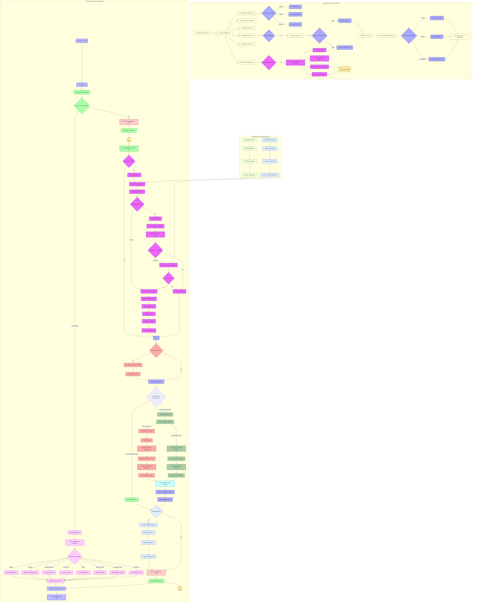

# Diagrama de Flujo Actualizado - Behemot Framework con Morphing

## 📊 Leyenda de Colores

- 🟡 **Amarillo** (initialNodes): Inicialización del sistema
- 🔵 **Azul claro** (apiNodes): Endpoints API y comunicación
- 🟢 **Verde** (processingNodes): Procesamiento general
- 🔷 **Azul** (modelNodes): Modelos de IA y llamadas
- 🔴 **Rojo** (ragNodes): Sistema RAG
- 🟣 **Verde oscuro** (toolNodes): Herramientas externas
- 🟠 **Naranja** (storageNodes): Almacenamiento (Redis)
- 🔺 **Rosa** (securityNodes): Filtros de seguridad
- 🔵 **Cyan** (contextNodes): Enriquecimiento de contexto
- 🟪 **Púrpura** (commandNodes): Comandos administrativos
- 🟣 **Violeta** (morphingNodes): Sistema de Morphing
- 🔷 **Azul claro** (feedbackNodes): Sistema de Feedback
- 🟨 **Amarillo claro** (abTestNodes): A/B Testing

## 🔄 Nuevos Flujos Agregados

### 1. **Inicialización Morphing**
- Carga de configuración de morphs
- Inicialización de triggers instantáneos
- Configuración del analizador gradual
- Conexión con Redis para feedback y A/B testing

### 2. **Procesamiento Morphing**
- Aplicación de configuración A/B test
- Detección instantánea (0ms)
- Análisis gradual multi-dimensional (150ms)
- Anti-loop protection
- Preservación y transición de contexto

### 3. **Sistema de Feedback**
- Detección automática de feedback implícito
- Registro en Redis
- Actualización de confianza
- Métricas para A/B testing

### 4. **Mejora Continua**
- Análisis de patrones de feedback
- Optimización automática con A/B testing
- Aplicación de configuraciones ganadoras

### 5. **Comandos Nuevos**
- `&morphing_stats`: Estadísticas del sistema de morphing
- `&ab_results`: Resultados de tests A/B activos

### 6. **Multi-Provider Support**
- OpenAI (GPT-4, GPT-3.5)
- Google Gemini (Pro, Flash)
- Vertex AI
- Embeddings: OpenAI, Google, HuggingFace

### 7. **AUTO_RAG**
- Búsqueda automática antes de responder
- Enriquecimiento transparente del contexto